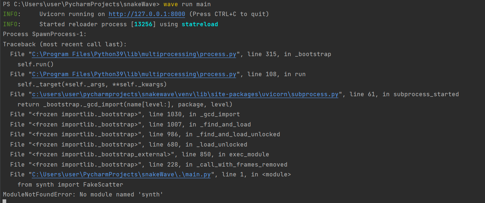
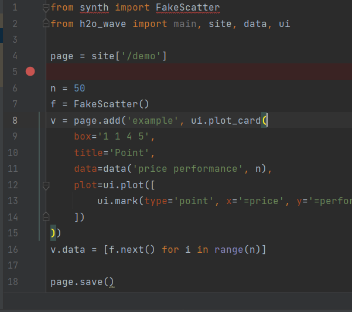

# Synth Package Add to Wave


H2O wave [plot](https://wave.h2o.ai/docs/examples/plot-point-sizes) add synth package. Without synth, it shows following error.

###Run  wave app


###Import the synth, it shows the error.


###Run the following command

```bash
    pip install -i https://test.pypi.org/simple/ synth
```


###Run the App

```bash
 wave run main
```

###View the App

Point your favorite web browser to [localhost:10101/demo](http://localhost:10101/demo)

### pip package

    https://test.pypi.org/project/synth/0.0.2/